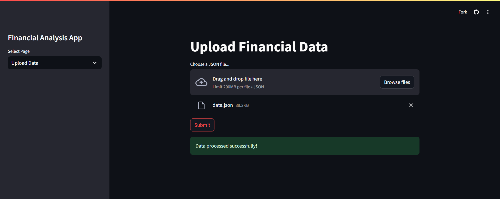
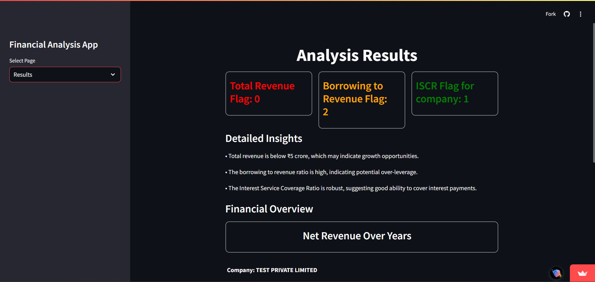
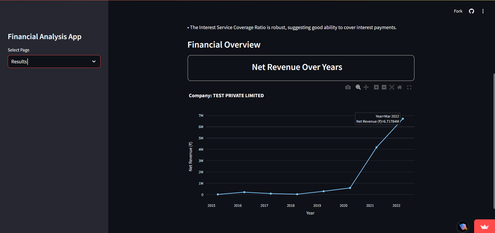

# Financial Analysis Model and Web Application

This project is a two-part challenge that involves building a financial analysis model and creating a web application to utilize the model.

---

## 📖 Problem Statement

### **Module 1 - Financial Analysis Model (1 Hour)**

Create a simple financial analysis model using the following files:

1. **rules.py**: Contains predefined rules for financial analysis. You are required to implement the functions as per the comments provided. The example function `latest_financial_index` serves as a reference.
2. **model.py**: Processes the rules from `rules.py` and outputs results in JSON format.
3. **data.json**: Sample dataset used as input for the analysis model.

### **Module 2 - Web Application (30 Minutes)**

Develop a web application using the framework or tool of your choice. The application consists of two pages:

1. **Page 1: Upload Data**  
   - Allows users to upload the `data.json` file.  
   - On submission, processes the file using the model created in **Module 1** and displays the results in JSON format.

2. **Page 2: Results**  
   - Displays the results obtained from `model.py` in a structured and interactive manner.

---

## 🚀 Features

1. **Financial Analysis Model**  
   - Evaluates multiple financial metrics using rules defined in `rules.py`.  
   - Flags include:  
     - **TOTAL_REVENUE_5CR_FLAG**: Checks if total revenue exceeds ₹5 crore.  
     - **BORROWING_TO_REVENUE_FLAG**: Verifies if the borrowing-to-revenue ratio is healthy.  
     - **ISCR_FLAG**: Evaluates the Interest Service Coverage Ratio (ISCR).  

2. **Interactive Web Application**  
   - **Upload Financial Data**: Upload the financial dataset and process it.  
   - **Detailed Results**: View flags, insights, and visualizations of financial trends.  

3. **Visualizations**  
   - Displays trends in net revenue using interactive line charts with Plotly.

---

## 📂 Project Structure

```plaintext
.
├── app.py              # Main Streamlit app for the web application
├── model.py            # Financial analysis model
├── rules.py            # Rule definitions for financial analysis
├── data.json           # Sample dataset
├── requirements.txt    # Dependencies for the project
└── README.md           # Project documentation

```
## 🛠️ Setup and Installation

### Prerequisites
Ensure that the following are installed on your system:
- Python 3.8 or higher
- [Streamlit](https://streamlit.io/)
- [Plotly](https://plotly.com/python/)

### Installation Steps

1. **Clone the Repository**  
   Clone the GitHub repository to your local system using the following command:
   ```bash
   git clone https://github.com/your-username/financial-analysis-app.git
   cd financial-analysis-app
2. **Install Dependencies**  
   Install all required Python libraries from requirements.txt: 
   ```bash
   pip install -r requirements.txt
3. **Run the Application**  
   Start the Streamlit application with:
   ```bash
   streamlit run app.py

## Hosted :
[Financial Analysis](https://karbon-3tymrqbxbsubejtpborjgj.streamlit.app/)

(Upload the data.json from this repo)

## Screenshots 💻

Main Page

Analysis

Visualization


